# SOLID Principles

**Single Responsibility Principle**

A class should have one and only one reason to change, meaning that a class should have only one job.

**Open - Closed Principle**

Objects or entities should be open for extension, but closed for modification.

**Liskov Substitution Principle**

Objects in a program should be replaceable with instances of their subtypes without altering the correctness of that program." See also design by contract.

**Interface Segregation Principle**

A client should never be forced to implement an interface that it doesn't use or clients shouldn't be forced to depend on methods they do not use.

**Dependency Inversion Principle**

Entities must depend on abstractions not on concretions. It states that the high level module must not depend on the low level module, but they should depend on abstractions.

# Object Oriented Design Patterns

## 1. Creational Patterns

### 1.1. Factory and Factory Method
**1.1.1. Intent** To separate the responsibility of object creation from its user

**1.1.2. Applicability** In all applications while creating an object against an interface

**1.1.3. Benefit** Helps in decoupling the application code from the service implementation

**1.1.4. Class Model**

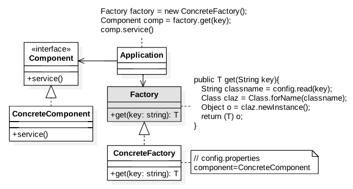

**1.1.5. Collaboration Model**

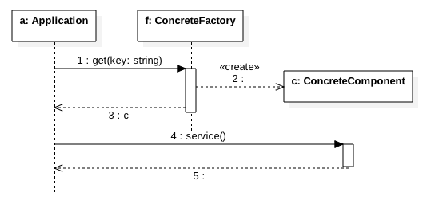

#### 1.1.6. Problem ####

***Component.java***
```
package com.glarimy.factory;

public class Component {

	public void service() {
		System.out.println("Component::service()");
	}

}
```

***Application.java***
```
package com.glarimy.factory;

public class Application {
	public static void main(String[] args) {
		Component component = new Component();
		component.service();
	}
}
```
#### 1.1.7. Solution ####

***Component.java***

```
package com.glarimy.factory;

public interface Component {
	public void service();
}
```

***ConcreteComponent.java***
```
package com.glarimy.factory;

public class ConcreteComponent implements Component {

	@Override
	public void service() {
		System.out.println("ConcreteComponent::service");
	}

}
```

***Factory.java***
```
package com.glarimy.factory;

public interface Factory<T> {
	T get(String key) throws Exception;
}
```

***ConcreteFactory.java***
```
package com.glarimy.factory;

import java.io.FileReader;
import java.util.Properties;

public class ConcreteFactory<T> implements Factory<T> {
	private Properties props;

	public ConcreteFactory() throws Exception {
		props = new Properties();
		props.load(new FileReader("config.properties"));
	}

	@Override
	@SuppressWarnings({ "rawtypes", "unchecked" })
	public T get(String key) throws Exception {
		Class claz = Class.forName(props.getProperty(key));
		return (T)claz.newInstance();
	}
}
```

***config.properties***
```
component=com.glarimy.factory.ConcreteComponent
```

***Application.java***
```
package com.glarimy.factory;

public class Application {
	public static void main(String[] args) throws Exception {
		Factory<Component> factory = new ConcreteFactory<>();
		Component component = factory.get("component");
		component.service();
	}
}
```

#### 1.1.8 Solution in C++ ####

```
#include <iostream>

using namespace std;

class Object
{
};

class Component : public Object
{
public:
    virtual void service() = 0;
};

class ConcreteComponent : public Component
{
public:
    ConcreteComponent() {}

    void service()
    {
        cout << "ConcreteComponent::service" << endl;
    }
};

class Factory
{
public:
    static Object *get(string key)
    {
        if (key == "component")
        {
            return new ConcreteComponent();
        }
        throw "Object not available";
    }
};

int main()
{
    try
    {
        Component *component = (Component *)Factory::get("component");
        component->service();
    }
    catch (char const *m)
    {
        cout << m << endl;
    }
    return 0;
}
```

### 1.2. Abstract Factory
**1.2.1. Intent** To choose a factory from several available factories for a given interface

**1.2.2. Benefits** Helps in decoupling client applications from the vendor implementations

**1.2.3. Applicability** In cases where the API and its implementation are done by different vendors

**1.1.4. Class Model**

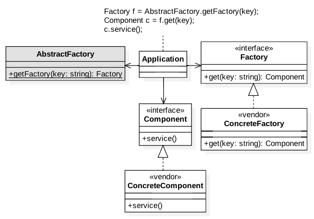

**1.1.4. Collaboration Model**


### 1.3. Singleton
**1.3.1. Intent** To limit the number of instances of a class to a maximum of one

**1.3.2. Applicability** Normally used in configuration, cache and etc., 

**1.3.3. Benefits** Helps in maintaining the application context in memory

**1.3.4. Class Model**


**1.3.5. Problem**

***Component.java***
```
package com.glarimy.singleton;

public class Component {
	public void service() {
		System.out.println("Component::execute");
	}

}
```

***Application.java***
```
package com.glarimy.singleton;

public class Application {
	public static void main(String[] args) throws Exception {
		Component component = new Component();
		component.service();
	}
}
```

**1.3.6. Solution**

***Component.java***
```
package com.glarimy.singleton;

public class Component {

	private static Component INSTANCE = null;

	private Component() {

	}

	public static synchronized Component getInstance() {
		if (INSTANCE == null)
			INSTANCE = new Component();
		return INSTANCE;
	}

	public void service() {
		System.out.println("Component::execute");
	}

}
```

***Application.java***
```
package com.glarimy.singleton;

public class Application {
	public static void main(String[] args) throws Exception {
		Component component = Component.getInstance();
		component.service();
	}
}
```

**1.3.7. C++**

```
#include <iostream>

using namespace std;

class Component
{
private:
    static Component *INSTANCE;
    Component()
    {
        cout << "Instantiated" << endl;
    };

public:
    static Component *getInstance()
    {
        if (INSTANCE == nullptr)
            INSTANCE = new Component();
        return INSTANCE;
    }

    void service()
    {
        cout << "ConcreteComponent::service" << endl;
    }
};

Component *Component::INSTANCE = nullptr;

int main()
{
    Component *component = Component::getInstance();
    component->service();
    return 0;
}
```

### 1.4. Builder
**1.4.1. Intent** To build an immutable object interactively

**1.4.2. Applicability** Often used in query builders, request builders and etc.,  

**1.4.3. Benefits** Defers creation of heavy and complex objects as much as possible

**1.4.4. Class Model**

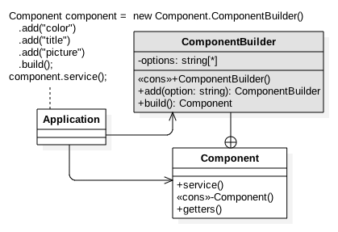

**1.4.5. Collaboration Model**


**1.4.6. Problem**

***Component.java***
```
package com.glarimy.builder;

import java.util.ArrayList;
import java.util.List;

public class Component {
	private List<String> options = new ArrayList<String>();

	public Component(String first, String second, String third) {
		this.options.add(first);
		this.options.add(second);
		this.options.add(third);
	}

	public List<String> getOptions() {
		return options;
	}

	public void setOptions(List<String> options) {
		this.options = options;
	}

	public void service() {
		System.out.println(this.options);
	}

}
```

***Application.java***
```
package com.glarimy.builder;

public class Application {
	public static void main(String[] args) throws Exception {
		Component order = new Component("color", "title", "picture");
		order.service();
	}
}
```

**1.4.7. Solution**

***Component.java***
```
package com.glarimy.builder;

import java.util.ArrayList;
import java.util.List;

public class Component {
	private List<String> options = new ArrayList<String>();

	private Component(String first, String second, String third) {
		this.options.add(first);
		this.options.add(second);
		this.options.add(third);
	}

	public String[] getOptions() {
		return (String[]) options.toArray();
	}

	public void service() {
		System.out.println(this.options);
	}
	
	public static class ComponentBuilder{
		private List<String> options = new ArrayList<String>();
		
		public ComponentBuilder add(String option) {
			options.add(option);
			return this;
		}
		
		public Component build() {
			return new Component(options.get(0), options.get(1), options.get(2));
		}
	}

}
```

***Application.java***
```
package com.glarimy.builder;

public class Application {
	public static void main(String[] args) throws Exception {
		Component component = new Component.ComponentBuilder().add("color").add("title").add("picture").build();
		component.service();
	}
}
```

**1.4.8 C++ Solution**
```
#include <iostream>

using namespace std;

class Component
{
private:
    Component() {}
    string color;
    string title;
    string picture;

public:
    void service()
    {
        cout << color << " " << title << " " << picture << endl;
    }
    class ComponentBuilder;
};

class Component::ComponentBuilder
{
private:
    string color;
    string title;
    string picture;

public:
    ComponentBuilder() {}
    ComponentBuilder *setColor(string option)
    {
        color = option;
        return this;
    }
    ComponentBuilder *setTitle(string option)
    {
        title = option;
        return this;
    }
    ComponentBuilder *setPicture(string option)
    {
        picture = option;
        return this;
    }
    Component *build()
    {
        Component *component = new Component();
        component->color = color;
        component->picture = picture;
        component->title = title;
        return component;
    }
};

int main()
{
    Component *component = Component::ComponentBuilder()
        .setColor("yellow")
        ->setPicture("landscape")
        ->setTitle("frame")
        ->build();
    component->service();
    return 0;
}
```

## 2. Structural Patterns

### 2.1. Adapter
**2.1.1. Intent** To provide a known interface to an unknown object

**2.1.2. Applicability** Often used as a protection layer between application and third-party components 

**2.1.3. Benefits** Avoids tight coupling with third-party code

**2.1.4. Class Model**

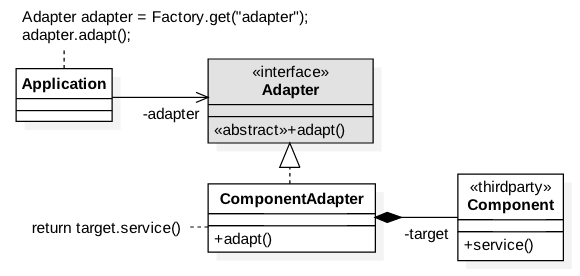

**2.1.5. Collaboration Model**

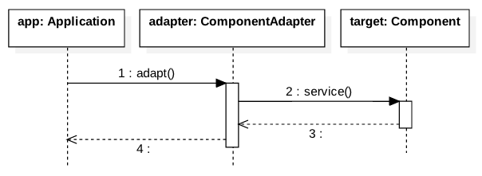

**2.1.6. Problem**

***Component.java***
```
package com.glarimy.adapter;

public class Component {

	public void service() {
		System.out.println("Component::service()");
	}

}
```

***Application.java***
```
package com.glarimy.adapter;

public class Application {
	public static void main(String[] args) {
		Component component = new Component();
		component.service();
	}
}
```

**2.1.7. Solution**

***Component.java***
```
package com.glarimy.thirdparty;

public class Component {

	public void service() {
		System.out.println("Component::service()");
	}

}
```

***Adapter.java***
```
package com.glarimy.app;

public interface Adapter {
	public void adapt();
}
```

***ConcreteAdapter.java***
```
package com.glarimy.app;

import com.glarimy.thirdparty.Component;

public class ComponentAdapter implements Adapter {
	private Component component;

	public ComponentAdapter() {
		this.component = new Component();
	}

	@Override
	public void adapt() {
		this.component.service();
	}

}
```

***Application.java***
```
package com.glarimy.app;

public class Application {
	public static void main(String[] args) {
		Adapter adapter = new ComponentAdapter();
		adapter.adapt();
	}
}
```

**2.1.8. C++ Solution**

```
#include <iostream>
using namespace std;

class Adapter 
{
public:
    virtual void adapt() = 0;
};

class Component
{
public:
    void service()
    {
        cout << "Component::service()" << endl;
    }
};

class ComponentAdapter : public Adapter
{
    private:
        Component* target;
public:
    ComponentAdapter()
    {
        target = new Component();
    }
    void adapt()
    {
        this->target->service();
    }
};

class Factory
{
public:
    static Adapter* get(string key)
    {
        if (key == "adapter")
        {
            return new ComponentAdapter();
        }

        throw "Object not available";
    }
};

int main()
{
    try
    {
        Adapter* adapter = Factory::get("adapter");
        adapter->adapt();
    }
    catch (const char* e)
    {
        cout << e << endl;
    }
    return 0;
}
```

### 2.2. Proxy
**2.2.1. Intent** To do pre and post processing anonymously

**2.2.2. Applicability** Popular in offering pluggable quality features

**2.2.3. Benefits** Helps in separating the concerns

**2.2.4. Class Model**

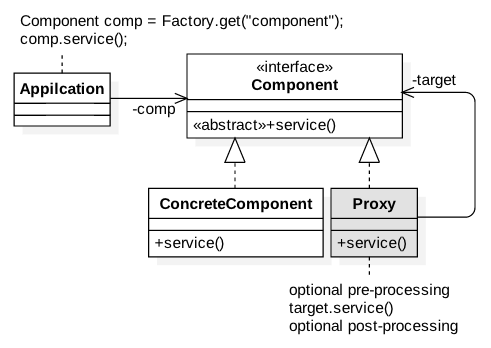

**2.2.5. Collaboration Model**

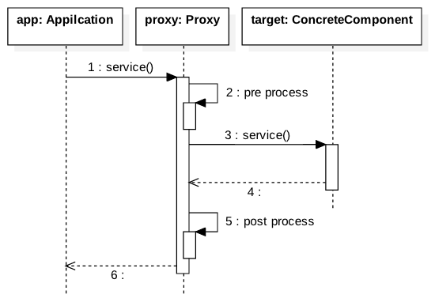

**2.2.6 Problem**

***Component.java***
```
package com.glarimy.proxy;

public class Component {

	public void service() throws Exception {
		System.out.println("Component::service");
	}

}
```

***Application.java***
```
package com.glarimy.proxy;

public class Application {
	public static void main(String[] args) throws Exception {
		Component comp = new Component();
		comp.service();
	}
}
```

**2.2.7 Solution**

***Component.java***
```
package com.glarimy.proxy;

public interface Component {

	public void service() throws Exception;

}
```

***ConcreteComponent.java***
```
package com.glarimy.proxy;

public class ConcreteComponent implements Component {

	public void service() throws Exception {
		System.out.println("ConcreteComponent::service");
	}

}
```

***Proxy.java***
```
package com.glarimy.proxy;

public class Proxy implements Component {
	private Component target;

	public Proxy(Component target) {
		this.target = target;
	}

	public void service() throws Exception {
		System.out.println("Proxy::pre processing");
		try {
			target.service();
			System.out.println("Proxy::post processing");
		}catch(Exception e) {
			System.out.println("Proxy::error handling");
			throw e;
		}
	}

}
```

***Application.java***
```
package com.glarimy.proxy;

public class Application {
	public static void main(String[] args) throws Exception {
		Component target = new ConcreteComponent();
		Component proxy = new Proxy(target);
		
		proxy.service();
	}
}
```

**2.2.8 C++ Solution**

```
#include <iostream>
using namespace std;

class Component 
{
public:
    virtual void service() = 0;
};

class ConcreteComponent: public Component
{
public:
    void service()
    {
        cout << "ConcreteComponent::service()" << endl;
    }
};

class Proxy : public Component
{
    private:
        Component* target;
public:
    Proxy(Component* target)
    {
        this->target = target;
    }
    void service()
    {
        cout << "Proxy: pre-processing" << endl;
        this->target->service();
        cout << "Proxy: post-processing" << endl;
    }
};

class Factory
{
public:
    static Component* get(string key)
    {
        if (key == "component")
        {
            return new Proxy(new ConcreteComponent());
        }

        throw "Object not available";
    }
};

int main()
{
    try
    {
        Component* component = Factory::get("component");
        component->service();
    }
    catch (const char* e)
    {
        cout << e << endl;
    }
    return 0;
}
```

### 2.3. Decorator
**2.3.1. Intent** To extend an object

**2.3.2. Applicability** Often used to provide add-on features

**2.3.3. Benefits** Offloads optional functionality from objects

**2.3.4. Class Model**

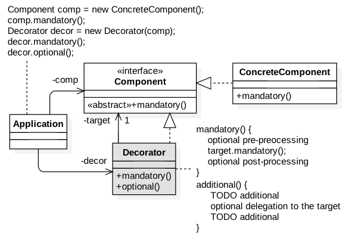

**2.3.5. Collaboration Model**


**2.3.6 Problem**

***Component.java***
```
package com.glarimy.decorator;

public class Component {
	public void mandatory() {
		System.out.println("Component::mandatory");
	}
	public void optional() {
		System.out.println("Component::optional");
	}
}
```

***Application.java***
```
package com.glarimy.decorator;

public class Application {
	public static void main(String[] args) throws Exception {
		Component comp = new Component();
		comp.mandatory();
		comp.optional();
	}
}
```

**2.3.7 Solution**

***Component.java***
```
package com.glarimy.decorator;

public interface Component {
	public void mandatory();
}
```

***ConcreteComponent.java***
```
package com.glarimy.decorator;

public class ConcreteComponent implements Component {
	@Override
	public void mandatory() {
		System.out.println("Component::mandatory");
	}
}

```

***Decorator.java***
```
package com.glarimy.decorator;

public class Decorator implements Component {
	private Component target;
	
	public Decorator(Component target) {
		this.target = target;
	}
	
	public void mandatory() {
		this.target.mandatory();
	}
	
	public void optional() {
		System.out.println("Decorator::optional pre processing");
		this.target.mandatory();
		System.out.println("Decorator::optional post processing");

	}
}
```

***Application.java***
```
package com.glarimy.decorator;

public class Application {
	public static void main(String[] args) throws Exception {
		Component comp = new ConcreteComponent();
		comp.mandatory();
		Decorator decorator = new Decorator(comp);
		decorator.mandatory();
		decorator.optional();
	}
}
```

### 2.4. Composite
**2.4.1. Intent** To treat sum of the parts as a whole

**2.4.2. Applicability** Often used in GUI widget systems  

**2.4.3. Benefits** Enables addition and removal of objects from a heirarchy without disturbance

**2.4.4. Class Model**

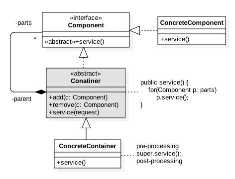

**2.4.5. Collaboration Model**

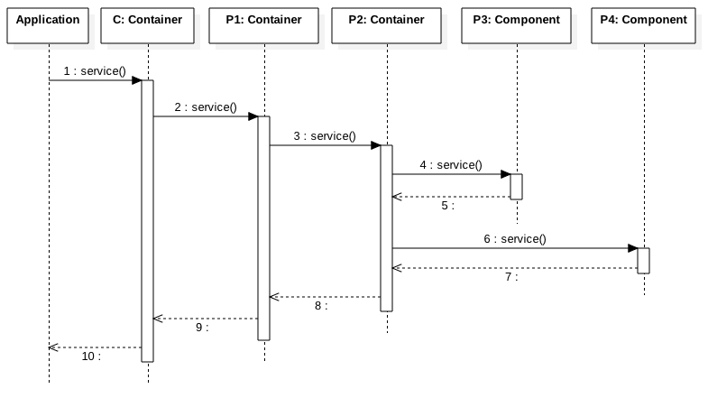

**2.4.6. Solution**

***Component.java***
```
package com.glarimy.composit;

public interface Component {
	public void service();
}
```

***Container.java***
```
package com.glarimy.composit;

import java.util.ArrayList;
import java.util.List;

public abstract class Container implements Component {
	private List<Component> parts = new ArrayList<>();
	
	public void add(Component part) {
		parts.add(part);
	}
	
	public void remove(Component part) {
		parts.remove(part);
	}
	
	public void service() {
		for(Component part: parts)
			part.service();
	}
}
```

***ConcreteComponent.java***
```
package com.glarimy.composit;

public class ConcreteComponent implements Component {

	@Override
	public void service() {
		System.out.println("ConcreteComponent::service");
	}
}
```

***ConcreteContainer.java***
```
package com.glarimy.composit;

public class ConcreteContainer extends Container {
	@Override
	public void service() {
		System.out.println("ConcreteContainer::service - start");
		super.service();
		System.out.println("ConcreteContainer::service - stop");
	}
}
```

***Application.java***
```
package com.glarimy.composit;

public class Application {
	public static void main(String[] args) throws Exception {
		Container container = new ConcreteContainer();
		Container partOne = new ConcreteContainer();
		Container partTwo = new ConcreteContainer();
		Component partThree = new ConcreteComponent();
		Component partFour = new ConcreteComponent();
		
		partTwo.add(partThree);
		partTwo.add(partFour);
		partOne.add(partTwo);
		
		container.add(partOne);
		
		container.service();
	}
}
```

### 2.5. Facade
**2.5.1. Intent** To hide internal collaboration of objects

**2.5.2. Applicability** Often provided as a front-end gateway to a reusable system

**2.5.3. Benefits** Protects the client applications from changes in the reusable system

**2.5.4. Class Model**

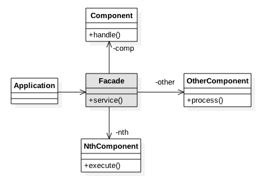

**2.5.5. Collaboration Model**

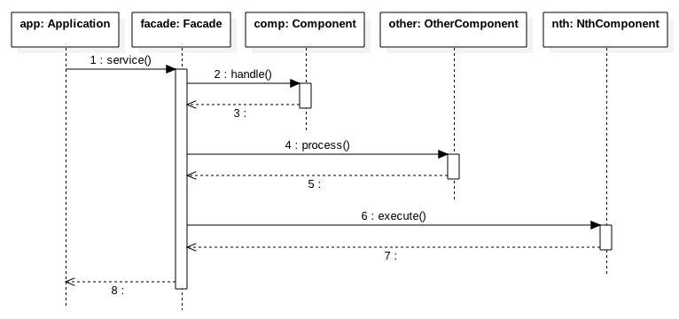

## 3. Behaviroual Patterns 

### 3.1. Chain of Responsibilities
**3.1.1. Intent** To escalate a call conditionally

**3.1.2. Applicability** Found MVC frameworks and Middleware with interceptors

**3.1.3. Benefits** Helps in plugging and plugging out interceptors without disturbing the heirarchy

**3.1.4. Class Model**

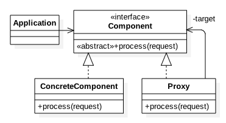

**3.1.5. Collaboration Model**

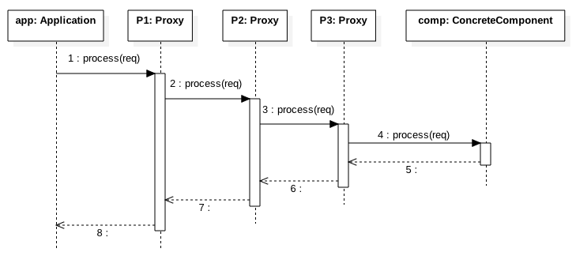

### 3.2. Mediator
**3.2.1. Intent** To enable intra-group communication asynchronously

**3.2.2. Applicability** Found in cluster management systems

**3.2.3. Benefits** Decouples the group members

**3.2.4. Class Model**

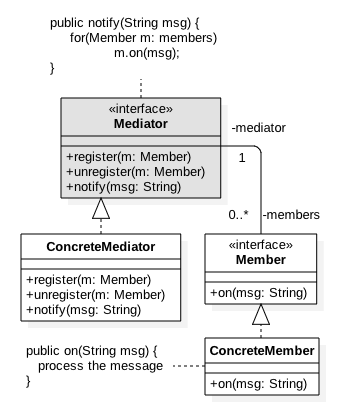

**3.2.5. Collaboration Model**

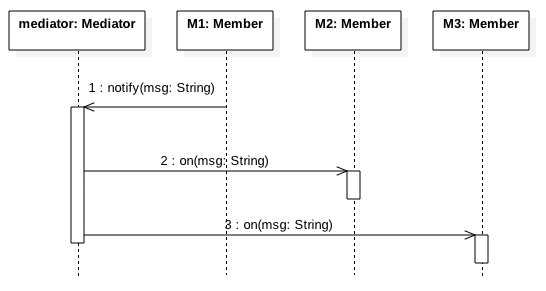

### 3.3. Observer
**3.3.1. Intent** To enable inter-group communication asynchronously

**3.3.2. Applicability** Found in messaging systems

**3.3.3. Benefits** Decouples the publishers and subscribers

**3.3.4. Class Model**

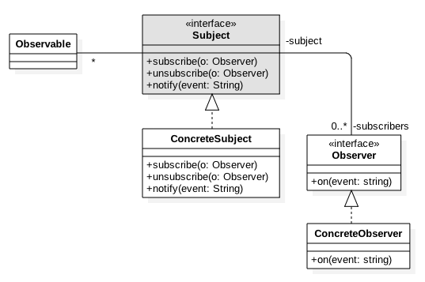

**3.3.5. Collaboration Model**

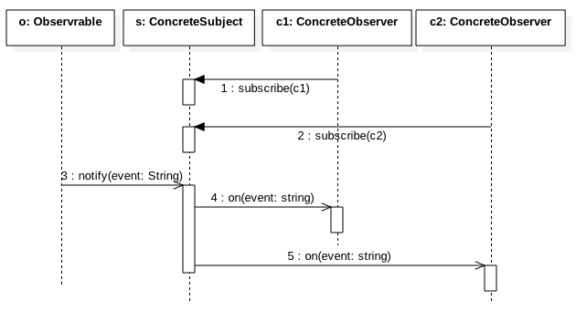

### 3.4. Strategy
**3.4.1. Intent** To choose an algorithm at runtime

**3.4.2. Applicability** Often used to offer customizable solutions

**3.4.3. Benefits** Helps in picking context specific implementation

**3.4.4. Class Model**


**3.4.5. Collaboration Model**


### 3.5. Template Method
**3.5.1. Intent** To build a generic algorithm

**3.5.2. Applicability** Often used when different algorithms share some common steps

**3.5.3. Benefits** Avoids code duplication

**3.5.4. Class Model**

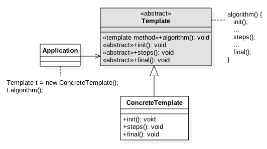

**3.5.5. Collaboration Model**

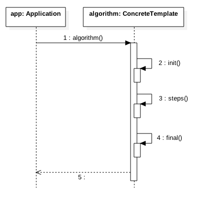

### 3.6. Iterator
**3.6.1. Intent** To travers through an datastructure without knowing the structure

**3.6.2. Applicability** Often used lists, collections, trees, graphs and etc., 

**3.6.3. Benefits** Provides unified way to iterate through a collection of elements

**3.6.4. Class Model**

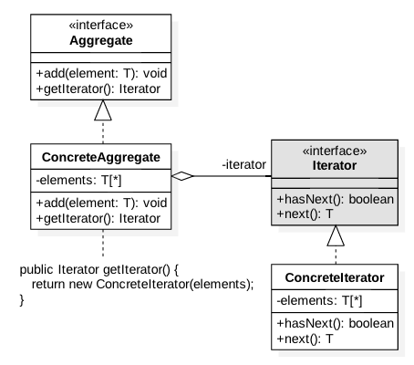

**3.6.5. Collaboration Model**

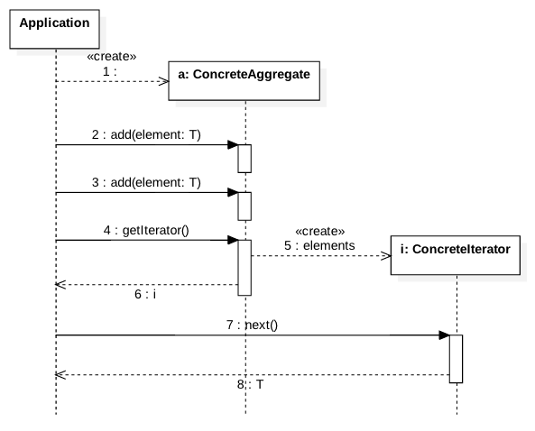

### 3.7. Visitor
**3.7.1. Intent** To decorate an object graph

**3.7.2. Applicability** Helps in offering new features without disturbing the interface

**3.7.3. Benefits** Easy to add additional functionality

**3.7.4. Class Model**

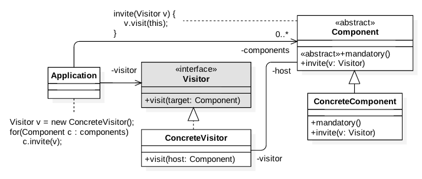

**3.7.5. Collaboration Model**

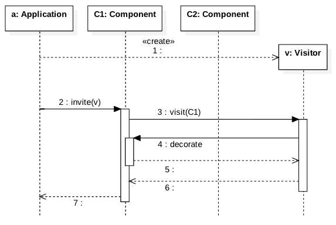

### 3.8. State
**3.8.1. Intent** To build state machine

**3.8.2. Applicability** Obvious

**3.8.3. Benefits** Helps in adding and removing states easily

**3.8.4. Class Model**


**3.8.5. Collaboration Model**


### 3.9. Command
**3.9.1. Intent** To act as a callback object

**3.9.2. Applicability** Used in event driven systems

**3.9.3. Benefits** Helps in non-blocking asynchronous systems

**3.9.4. Class Model**

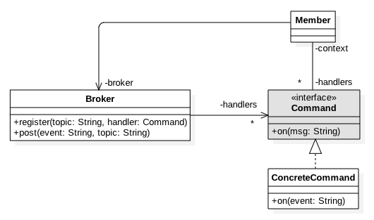

**3.9.5. Collaboration Model**

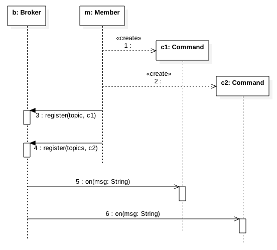
