### 2.2. Activity Diagram ###
Represents a workflow in the system.

#### 2.2.1. Action ####
A workflow/activity is a set of actions arranged in a logical order.

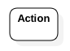

#### 2.2.2. Activity Flows ####

Every activity starts from an "initial action".

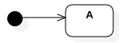

Every activity ends with a "terminal action".

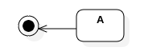

Usually, the control of an activity is passed from one action to another action.

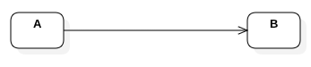

Sometimes, the control of an activity is passed to the actions based on conditions.

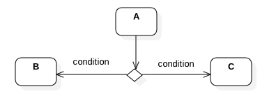

Often, several action paths might merge at a common point also.

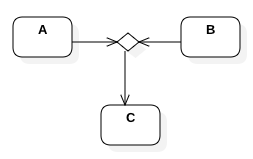

Also, the control of an activity might be passed to multiple actions in parallel.

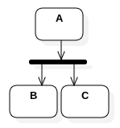

Similarly, several action paths join together before passing the control to the next action.

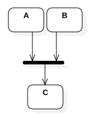

#### 2.2.3. Activity Partitions ####

Several actions might be grouped together for better readability.

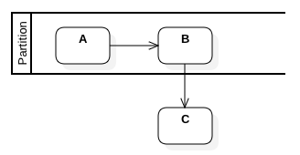

#### 2.2.4. Special Actions ####

An action might be part of an interruptable region.

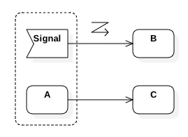

An action can be very complex which demands further granularity.

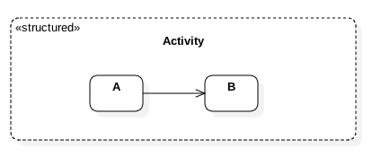

An action might be asynchronous as well.

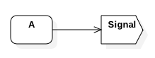

Sometimes, delay/wait/etc., might also needs to be represented.

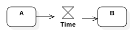

It is also possible to show an object flow between actions.

Exception handlers are special actions.

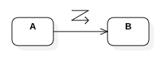

As an alternative to object flows, input/output pins are also used.

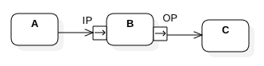

Illustration of pins:

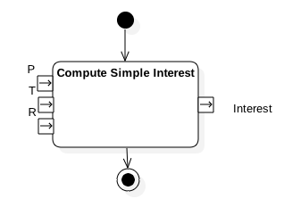

#### 2.2.5. Activity Illustrations ####

Illustration-1:

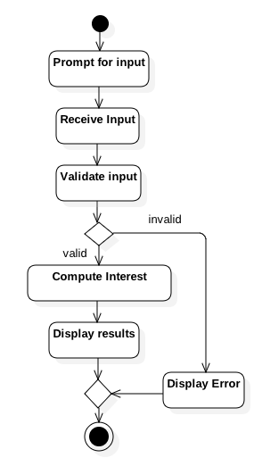

Illustration-2:

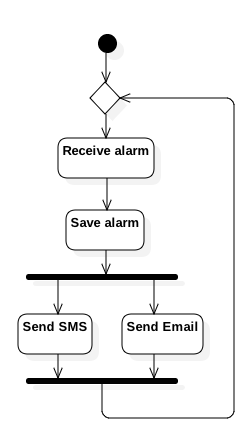

Illustration-3:

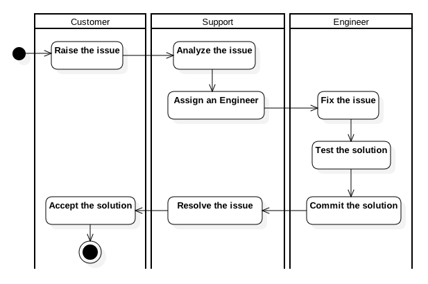

Illustration-4:

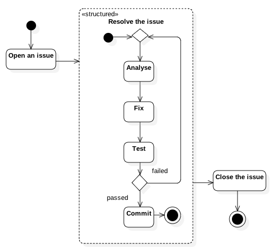