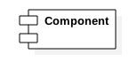
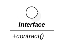
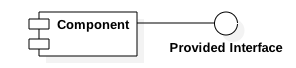
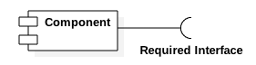
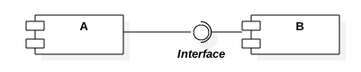
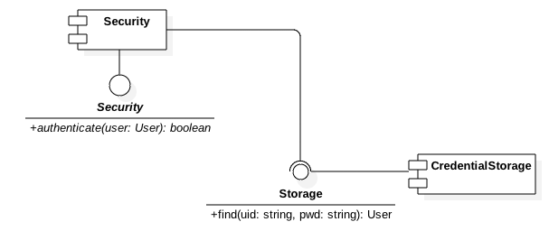

### 1.3. Component Diagram ###

Represents functional grouping of classes.

#### 1.3.1. Component ####

A cohessive modular unit of functionality.

#### 1.3.2. Component Relations ####

A component is always associated with one or more interfaces.

A component provides an interface.

A component requires an interface.

Two components are coupled through an interface.

#### 1.3.3. Component Diagram Illustration ####
