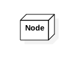
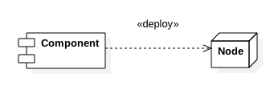
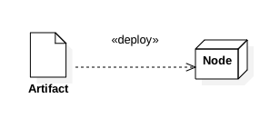
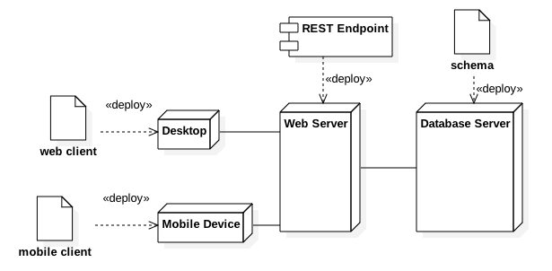

### 1.4. Deployment Diagram ###
Represents association between logical artifacts and physical devices.

#### 1.4.1. Node ####

A physical machine, device, environment and etc., 

#### 1.4.2. Node Relations ####

A component might be deployed on to a node.

An artifact like configuration file and etc., might be deploed on to a node.

Two nodes might be connected physically via network and etc., 

#### 1.4.3. Deployment Diagram Illustration ####
