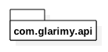
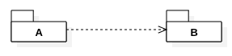
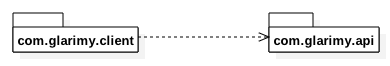
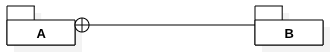
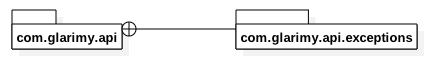
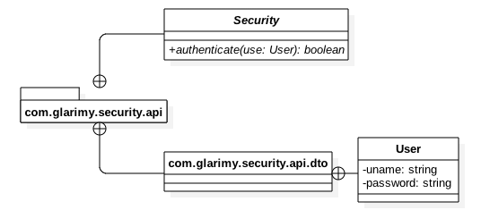
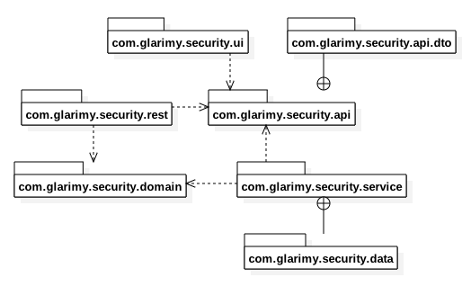

### 1.2. Package Diagram ###
Represents logical grouping of classes.

#### 1.2.1. Package ####
A package consists of classes and sub-packages that are logically close to each other.


Various languages implement a pacakge as a modules, a namespaces and etc.,



#### 1.2.2. Package Relations ####
A package may import/depend on other package.



Illustration: 

```
package com.glarimy.client;

import com.glarimy.api;
....

```



A package may include another package.



Illustration: 
```
    namespace com.glarimy.api {
        namespace exceptions {
            ...
        }
        ...
    }
```



#### 1.2.3. Package Diagram Illustration ####

Illustration-1: 



Illustration-2:

