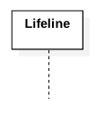
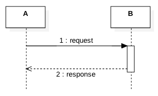
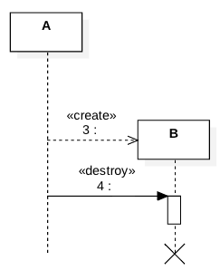
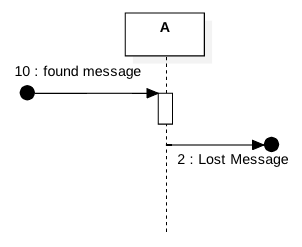
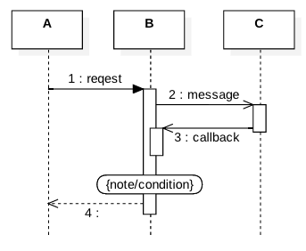
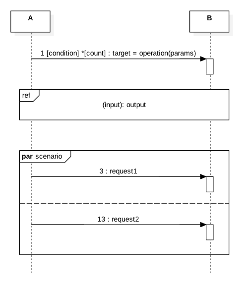
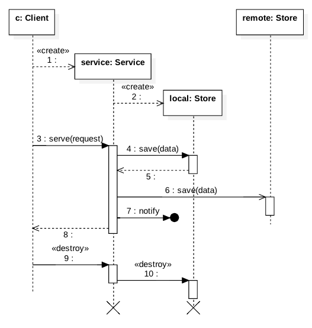

### 2.4. Sequence Diagram ###
Represents interactions among objects in a specific scenario.

#### 2.4.1. Lifeline ####
Represents an active object



#### 2.4.2. Interactions ####
Objects make requests and receive responses from other objects.



Objects also create or destroy other objects.



An object may act up on a signal or send a signal.



Objects may post messages to other objects or invoke call backs. A state-invariant node may annotate a lifefline.



#### 2.4.3. Fragments ####

A request may be representated as a parameterized operation with optional assignments, conditions and iterations.

Several messages might be grouped together for clarity.

Interactions like opt (if), alt(if-else), parallel, critical, iter and etc., are also represented as combined fragments.



#### 2.4.4. Illustration ####



```
class Client {
    public static void main(String[] args) {
        Service service = new Service();
        service.serve(request);
        destroy service;
    }
}

class Service {
    private Store local; 
    private Store remote;

    public Service(Store remote) {
        local = new Store();
        this.remote = remote;
    }

    public void serve(request){
        local.save(data);
        remote.save(data);
        notify("message");
    }

    public finalize() {
        destroy local;
    }

}

class Store {
    public void save(data){
        
    }
}
```