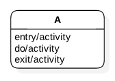
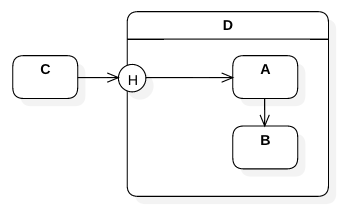

### 2.3. State Chart Diagram ###
Represents the system as a state machine.

#### 2.3.1. State ####
A snapshot of the system at a given time.

#### 2.3.2. State Transitions ####

Every state machine have an initial state.

Every state machine have a terminal state.

System moves from one state to another state up on a trigger/event/etc., 

The triggered transition may happen only if a pre-condition is satisfied.

Each system may take certain actions upon entering a state, while in the given state and while leaving the state.

#### 2.3.3. Kinds of States ####

A composite state is a super state of several sub states.

Illustration: Composite State

Transition to a compisite state always invokes the first sub state unless specified. A history vertex enables transition to the last active state, instead.

A substatemachine is a re-usable unit like procedure.

An orthogonal state is a composite state with parallel transitions.

Illustration: Orthogonal state

