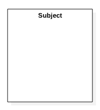
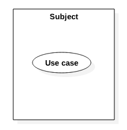
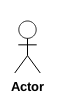
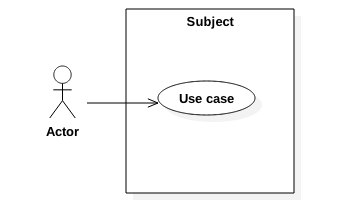
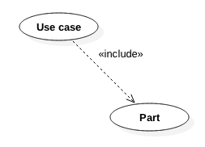
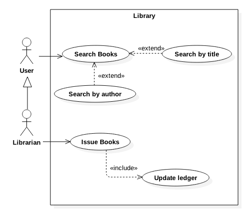

### 2.1. Usecase Diagram ###
Represents the system from an external perspective.

#### 2.1.1. Subject ####
The system or a module which is being presented from an external perspective .

#### 2.1.2. Usecase ####

The feature/functionality of the subject as seen from outside of the subject.

#### 2.1.3. Actor ####

The role of external users of the subject.

#### 2.1.4. Association ####

An actor always associates with one or more usecases. Similarly, a usecause is always assoiated with one more actors. 

#### 2.1.5. Extending Usecase ####

A usecase might have a specialized behavior under certian conditions.

#### 2.1.6. Extending Actor ####

An actor may extend the previleges of another actor.

#### 2.1.7. Including Usecase ####

A usecase might have another usecase as a part of it.

#### 2.1.8. Usecase Diagram Illustration ####
