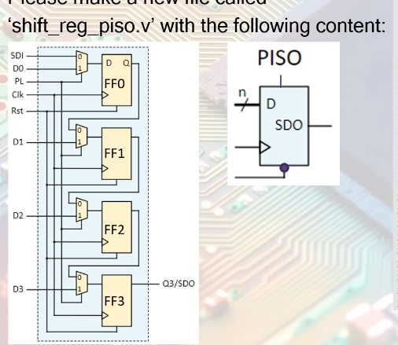

## Command to execute using verilator
```bash
rm dump.vcd; rm -rf obj_dir/; verilator --binary  --trace sum.v tb.v ; ./obj_dir/Vsum ; gtkwave dump.vcd
```

```bash
rm dump.vcd; rm -rf obj_dir/; verilator --binary  --trace adder_tree_behavioral.v tb_adder_tree_behavioral.v -Wno-WIDTHEXPAND ; ./obj_dir/Vadder_tree_behavioral ; gtkwave dump.vcd
```
# Diagram for PISO shift register


